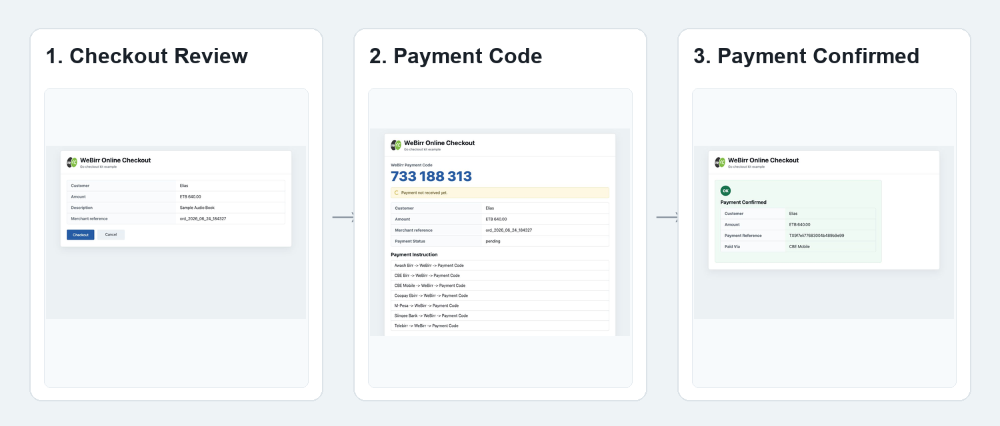

# WeBirr Checkout Kit for Go



Go backend helpers for WeBirr online checkout integrations. This package gives
custom Go merchant applications a server-side checkout pattern: the merchant
backend creates or resumes the WeBirr bill, the browser displays the WeBirr
Payment Code, the browser polls only merchant-owned endpoints, and the merchant
backend completes the payable after server-side verification.

The kit depends on the official Go client SDK:

```bash
go get github.com/webirr/webirr-checkout-kit-go
```

## Repository Layout

| Area | Path | Status |
| --- | --- | --- |
| Go checkout kit | repository root | Public package source for merchant-owned checkout endpoints. |
| `net/http` example | `examples/nethttp-memory` | Runnable Go merchant checkout example with mock mode by default and optional WeBirr TestEnv mode. |
| Unit tests | `checkout_test.go` | Tests for bill creation/recovery/update, status resolver modes, HTTP handlers, supported-bank instructions, and local completion. |

## What Is A Payable?

In this package, a `Payable` is the merchant-side record being paid. Depending on
the merchant application, it can be:

- an ecommerce order;
- a paid enrollment;
- a utility invoice;
- a customer bill;
- a booking, subscription, or service charge;
- any other merchant-owned record identified by `merchantReference`.

The WeBirr gateway creates a bill/payment code. The merchant application owns the
payable and resolves its amount, customer, description, and completion behavior.

## How The WeBirr Integration Works

The browser never calls WeBirr merchant APIs and never receives merchant API
credentials. The Go backend package is responsible for loading the merchant
payable, creating or recovering the WeBirr payment code, returning
merchant-supported banks, resolving payment status, and marking the payable paid
idempotently.

| Checkout role | Go package entry point | WeBirr call |
| --- | --- | --- |
| Load merchant payable | `Store.LoadPayable` | No WeBirr call; merchant database lookup |
| Create or resume payment code | `Checkout.CreateCheckout` / `Handler.CreateCheckout` | Create bill, recover bill by merchant reference, update unpaid bill when needed |
| Return supported banks | `Checkout.CreateCheckout` | `GET /einvoice/api/banks` through the official Go SDK |
| Poll payment status | `Checkout.GetStatus` / `Handler.GetStatus` | Default: server-side WeBirr payment-status check |
| Complete paid payable | `Store.MarkPaid` | Runs only after server-side paid verification |

The durable checkout key is `merchantReference`. No browser-facing checkout ID is
required for the baseline flow.

## Frontend Endpoint Contract

For web frontends and mobile frontends, the merchant app needs only these two
merchant-owned checkout endpoints. The browser or mobile app must call the
merchant backend, not the WeBirr merchant API.

| Frontend action | Merchant endpoint | Purpose |
| --- | --- | --- |
| Create or resume checkout | `POST /webirr/checkout` | Resolve the merchant payable by `merchantReference`, create or recover the WeBirr bill, save the payment-code mapping, and return safe display fields. |
| Poll payment status | `GET /webirr/checkout/status?merchantReference=...` | Read payment status through the configured status resolver, complete the local payable when paid, and return safe status fields. |

Create or resume request:

```http
POST /webirr/checkout
Content-Type: application/json

{"merchantReference":"ord_2026_06_24_10033"}
```

Create or resume response includes only display-safe fields such as:

```json
{
  "merchantReference": "ord_2026_06_24_10033",
  "paymentCode": "451 728 230",
  "amount": "640.00",
  "currency": "ETB",
  "customerName": "Elias",
  "status": "Pending",
  "supportedBanks": [
    {"bankID": "cbe_mobile", "name": "CBE Mobile"}
  ]
}
```

Status request:

```http
GET /webirr/checkout/status?merchantReference=ord_2026_06_24_10033
```

Paid status responses include `paymentReference` and `paymentIssuer` for the
confirmation screen. Pending responses should not expose merchant credentials or
raw gateway payloads.

## Install

```bash
go get github.com/webirr/webirr-checkout-kit-go
go get github.com/webirr/webirr-api-go-client
```

## Configure

Keep merchant credentials on the server side. The checkout kit receives a
gateway client, so TestEnv versus ProdEnv is selected when the merchant app
constructs the official Go SDK client.

For runnable examples, use `WEBIRR_CHECKOUT_MODE`:

| Mode | Purpose | Required credentials |
| --- | --- | --- |
| `mock` | Local UI/dev checks with no WeBirr credentials. This is the example default. | none |
| `testenv` | Real WeBirr TestEnv bill/payment-code creation. | `WEBIRR_TEST_ENV_MERCHANT_ID`, `WEBIRR_TEST_ENV_API_KEY` |
| `prod` | Merchant production deployment. | `WEBIRR_PROD_MERCHANT_ID`, `WEBIRR_PROD_API_KEY` |

Example TestEnv configuration:

```bash
export WEBIRR_CHECKOUT_MODE=testenv
export WEBIRR_TEST_ENV_MERCHANT_ID=your-test-merchant-id
export WEBIRR_TEST_ENV_API_KEY=your-test-env-api-key
```

Example ProdEnv configuration:

```bash
export WEBIRR_CHECKOUT_MODE=prod
export WEBIRR_PROD_MERCHANT_ID=your-production-merchant-id
export WEBIRR_PROD_API_KEY=your-production-api-key
```

Do not use production credentials for screenshots, local demos, or CI smoke
checks. Use mock mode or TestEnv mode for those cases.

## Basic Usage

```go
package main

import (
	"net/http"
	"os"
	"strings"

	checkout "github.com/webirr/webirr-checkout-kit-go"
	webirr "github.com/webirr/webirr-api-go-client"
)

func main() {
	mode := strings.ToLower(strings.TrimSpace(os.Getenv("WEBIRR_CHECKOUT_MODE")))
	isTestEnv := mode != "prod"

	merchantID := os.Getenv("WEBIRR_TEST_ENV_MERCHANT_ID")
	apiKey := os.Getenv("WEBIRR_TEST_ENV_API_KEY")
	if !isTestEnv {
		merchantID = os.Getenv("WEBIRR_PROD_MERCHANT_ID")
		apiKey = os.Getenv("WEBIRR_PROD_API_KEY")
	}

	client := webirr.NewClient(merchantID, apiKey, isTestEnv)

	store := checkout.NewMemoryStore()
	store.PutPayable(checkout.Payable{
		MerchantReference: "ord_2026_06_24_10033",
		Amount:            "640.00",
		Currency:          "ETB",
		CustomerName:      "Elias",
		CustomerCode:      "CUST-1001",
		CustomerPhone:     "0911000000",
		Description:       "Sample Audio Book",
		SuccessURL:        "/success",
		CancelURL:         "/cart",
	})

	handler := checkout.NewHandler(client, store)

	mux := http.NewServeMux()
	handler.Register(mux, "/webirr/checkout")
	http.ListenAndServe(":8080", mux)
}
```

The browser must not send the amount, API key, merchant ID, or WeBirr endpoint.
Those values are resolved by the merchant backend.

## Merchant Store

Production applications should implement `checkout.Store` using their own
database:

```go
type Store interface {
	LoadPayable(context.Context, string) (checkout.Payable, error)
	SavePaymentCode(context.Context, string, string) error
	MarkPaid(context.Context, string, checkout.PaymentResult) error
}
```

Responsibilities:

- `LoadPayable` resolves the order, invoice, enrollment, bill, booking, or other
  merchant-owned payable by `merchantReference`.
- `SavePaymentCode` stores the `merchantReference -> WeBirr Payment Code` mapping
  immediately after creation or recovery.
- `MarkPaid` completes the order, enrollment, receipt, service delivery, or access
  idempotently after server-side payment confirmation.

`checkout.NewMemoryStore()` is provided only for examples and tests.

## Default Payment Status

No status resolver is required for the common case:

```go
handler := checkout.NewHandler(client, store)
```

By default, the status endpoint calls WeBirr `GetPaymentStatus` through the
official Go SDK, updates the local store when paid, and returns safe status fields
to the checkout UI.

## Webhook Or Bulk Polling Status

If your application receives WeBirr webhook notifications or runs timestamp-based
bulk polling in the background, the checkout status endpoint can read from your
local payment table instead.

```go
handler := checkout.NewHandler(client, store, checkout.WithLocalStatus())
```

For local-first behavior with WeBirr fallback while still pending:

```go
handler := checkout.NewHandler(client, store, checkout.WithHybridStatus())
```

For full control:

```go
handler := checkout.NewHandler(
	client,
	store,
	checkout.WithStatusResolver(checkout.StatusResolverFunc(func(ctx context.Context, c *checkout.Checkout, payable checkout.Payable) (checkout.CheckoutStatusResult, error) {
		return checkout.CheckoutStatusResult{
			MerchantReference: payable.MerchantReference,
			Status:            checkout.StatusPending,
		}, nil
	})),
)
```

The status resolver answers only what the checkout UI should show now. Bill
creation and payment-code recovery stay in the create checkout flow.

## WeBirr Payment Flow

At a glance, the payment flow is:

### 1. Invoice Creation / Checkout On Purchase

- The customer starts a merchant checkout, invoice payment, paid enrollment, or
  similar payable flow.
- The merchant backend resolves the payable amount, customer, description, and
  stable `merchantReference`.
- The Go checkout kit creates or resumes the WeBirr bill and stores the WeBirr
  Payment Code through merchant callbacks.

### 2. Payment Code Display

- The browser displays the **WeBirr Payment Code**.
- Payment instructions are generated only from the merchant's `supportedBanks`
  response.
- The customer payment path is:
  `{Banking App} -> WeBirr menu -> Enter Payment Code -> Pay`.

### 3. Payment Status Monitoring

- Browser JavaScript polls the merchant backend status endpoint.
- The merchant backend resolves payment status using the default WeBirr status
  call, local webhook-updated state, local bulk-polling state, or a hybrid
  resolver.
- Manual refresh should appear only when polling fails; normal polling should be
  sequential.

### 4. Completion And Access

- Once WeBirr reports paid, or local verified status is paid, the merchant backend
  calls `MarkPaid` idempotently.
- The paid UI or success page shows Customer, Amount, Payment Reference, and Paid
  Via.

## Supported Banks

The create checkout response includes `supportedBanks`, loaded from the
merchant-scoped WeBirr supported banks endpoint. Checkout UI should render
instructions from that list, such as:

```text
CBE Mobile -> WeBirr -> Payment Code
Telebirr -> WeBirr -> Payment Code
```

Do not show a broad static bank list if the merchant's supported banks could not
be loaded.

## Example App

`examples/nethttp-memory` is a runnable Go merchant checkout example. It models
a small merchant app with an order page, checkout page, merchant-owned WeBirr
endpoints, and a success URL.

| Route | Purpose |
| --- | --- |
| `/orders/{merchantReference}` | Merchant order review page. |
| `/checkout?merchantReference=...` | Browser checkout page that displays the WeBirr Payment Code. |
| `/webirr/checkout` | Merchant-owned create/resume endpoint backed by the kit. |
| `/webirr/checkout/status?merchantReference=...` | Merchant-owned status endpoint backed by the kit. |
| `/orders/{merchantReference}/success` | Merchant success URL after local payment completion. |

The example uses an in-memory store to stay small. A production merchant app
would implement `checkout.Store` with its own order, invoice, enrollment, or bill
database.

Run it in mock mode:

```bash
go run ./examples/nethttp-memory
```

Mock mode requires no WeBirr credentials and is useful for UI checks, local
development, and CI-style verification. It still preserves the real architecture:
the browser calls merchant-owned endpoints, the backend returns safe checkout
fields, and payment status changes through the backend.

Run it against WeBirr TestEnv:

```bash
WEBIRR_CHECKOUT_MODE=testenv \
WEBIRR_TEST_ENV_MERCHANT_ID=your-test-merchant-id \
WEBIRR_TEST_ENV_API_KEY=your-test-api-key \
go run ./examples/nethttp-memory
```

Then open `http://localhost:8080`.

TestEnv mode creates a real WeBirr TestEnv bill, displays the real WeBirr Payment
Code format, and loads the merchant-supported bank list from WeBirr. The payment
will remain pending until the generated payment code is paid through an approved
TestEnv banking app or simulator.

Run it against WeBirr ProdEnv only from a merchant production deployment:

```bash
WEBIRR_CHECKOUT_MODE=prod \
WEBIRR_PROD_MERCHANT_ID=your-production-merchant-id \
WEBIRR_PROD_API_KEY=your-production-api-key \
go run ./examples/nethttp-memory
```

The legacy alias `WEBIRR_CHECKOUT_MODE=live` is treated as `testenv`. New
commands should use `testenv` or `prod` explicitly.

## Run Tests

If Go is installed:

```bash
go test ./...
```

If Go is not installed locally, use Docker:

```bash
docker run --rm -v "$PWD":/src -w /src golang:1.22 \
  sh -lc "/usr/local/go/bin/gofmt -w . && /usr/local/go/bin/go test ./..."
```

## Release Status

This package is not released publicly yet. Before the first release, create the
GitHub repository, register it as a hub submodule, run package validation, tag a
reviewed version, and create a matching GitHub Release.
