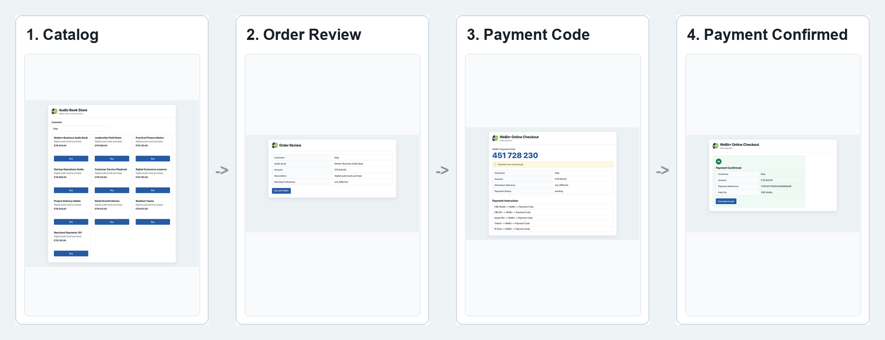
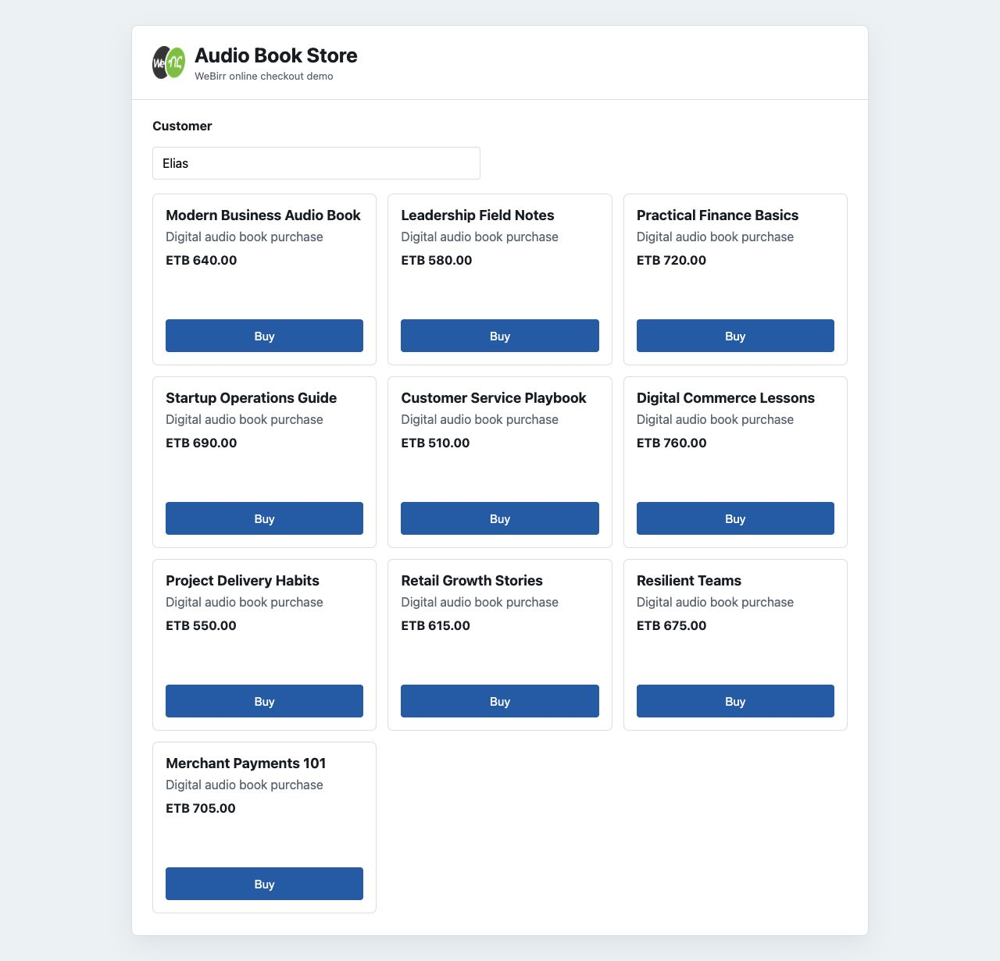
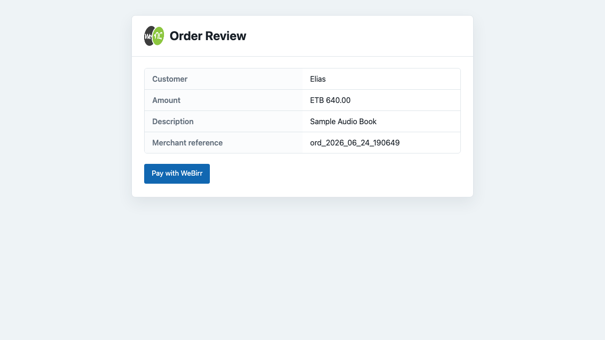
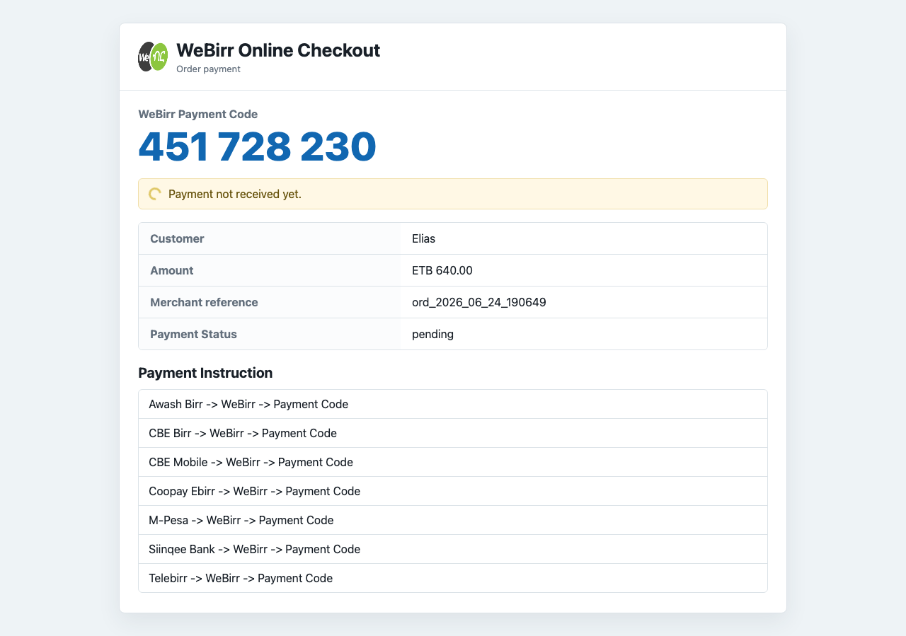
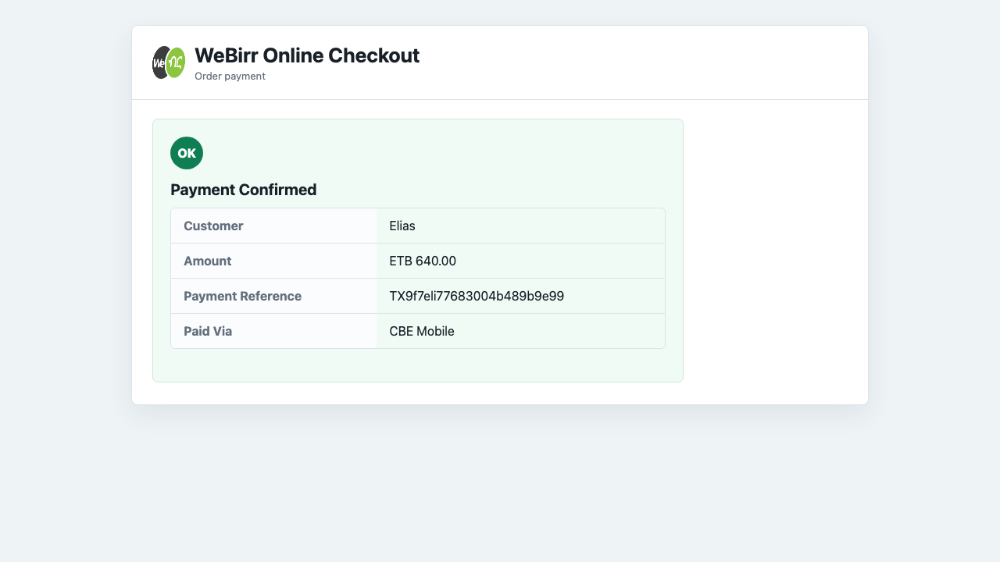

# WeBirr Checkout Web App Example



This is a runnable Go web app that demonstrates the merchant-owned WeBirr online
checkout pattern.

The app shows:

- a 10-item audio book catalog;
- a local order review page;
- a checkout page that displays the WeBirr Payment Code;
- merchant-owned create and status endpoints;
- SQLite-backed retry and recovery state;
- a `.txt` digital audio book receipt after paid confirmation;
- mock mode for local UI checks;
- optional WeBirr TestEnv or ProdEnv mode.

## Run

Mock mode needs no WeBirr credentials:

```bash
cd examples/checkout-web-app
go run .
```

Open:

```text
http://localhost:8080
```

The example creates a local SQLite database named
`webirr-checkout-demo.sqlite3`. It is ignored by Git.

## Docker Compose / Dokploy

For VPS deployment through Dokploy, use the Compose file in this example
directory. Compose is the deployment entrypoint and builds the example image from
the local Dockerfile:

```bash
WEBIRR_MERCHANT_ID=your-test-merchant-id \
WEBIRR_API_KEY=your-test-api-key \
WEBIRR_TEST_MODE=true \
docker compose up --build
```

The app will be available at `http://localhost:8080`. Compose passes only the
three WeBirr gateway variables and stores SQLite state in the
`webirr_checkout_data` volume mounted at `/data`, so payment-code retry/recovery
state survives container restarts.

## TestEnv Mode

Keep merchant credentials on the server side:

```bash
cd examples/checkout-web-app
WEBIRR_MERCHANT_ID=your-test-merchant-id \
WEBIRR_API_KEY=your-test-api-key \
WEBIRR_TEST_MODE=true \
go run .
```

TestEnv mode creates a real WeBirr TestEnv bill and displays the real WeBirr
Payment Code format. Payment remains pending until the code is paid through an
approved TestEnv banking app or simulator.

## ProdEnv Mode

Use production credentials only from a merchant production deployment:

```bash
cd examples/checkout-web-app
WEBIRR_MERCHANT_ID=your-production-merchant-id \
WEBIRR_API_KEY=your-production-api-key \
WEBIRR_TEST_MODE=false \
go run .
```

## Demo Flow

The home page shows a small audio book store. Customer name defaults to `Elias`
and cannot be empty. When the customer clicks `Buy`, the server creates a local
SQLite order with a generated `ord_{shortuuid}` merchant reference. The browser
then reviews that order and starts the standard WeBirr checkout flow.

The browser sends only the selected book ID and customer name when creating the
local demo order. Amount, currency, and description are resolved from the server
catalog.

The visible flow is:

```text
Catalog -> Order Review -> WeBirr Payment Code -> Payment Confirmed -> Receipt
```

## Screenshots

### Audio Book Catalog

The customer starts from the audio book catalog, enters a customer name, and
chooses a book with **Buy**.



### Order Review

The order review page shows the merchant-owned payable before WeBirr checkout
starts.



### Payment Code Display

The checkout page displays the **WeBirr Payment Code**, supported payment
instructions, merchant reference, and pending status.



### Payment Confirmation

After server-side payment verification, the page shows the payment reference,
paid-via value, and receipt download link.



## Endpoints

The browser calls only the merchant backend:

| Route | Purpose |
| --- | --- |
| `GET /` | Audio book catalog. |
| `POST /demo/orders` | Create a local demo order for the selected book. |
| `GET /orders/{merchantReference}` | Order review page. |
| `GET /checkout?merchantReference=...` | Checkout page. |
| `POST /webirr/checkout` | Create or resume the WeBirr payment code. |
| `GET /webirr/checkout/status?merchantReference=...` | Poll status and complete the local payable when paid. |
| `GET /orders/{merchantReference}/success` | Merchant success page. |
| `GET /orders/{merchantReference}/receipt.txt` | Download the demo receipt after payment is confirmed. |

Create request:

```json
{"merchantReference":"ord_2026_06_24_10033"}
```

The browser never sends the amount, API key, merchant ID, or WeBirr endpoint.
Those are resolved server-side.

## SQLite Store

The example stores checkout/payment state in SQLite:

```text
id
merchant_reference
demo_type
item_id
item_title
customer_name
amount
currency
description
webirr_payment_code
webirr_payment_status
webirr_payment_reference
webirr_paid_via
created_at
updated_at
paid_at
reversed_at
```

`merchant_reference` is the merchant-owned durable key. Platform-specific data
such as cart items, booking details, course IDs, shipping addresses, or tax rows
should stay in the merchant application's own tables.

## Status Values

Use the WeBirr status model:

```text
0 pending/not paid
1 paid-unconfirmed/in progress
2 paid
3 reversed/canceled
```

## Validate

From the example directory:

```bash
go test ./...
```

If Go is not installed locally, run from the repository root:

```bash
docker run --rm -v "$PWD":/src -w /src/examples/checkout-web-app golang:1.22 \
  sh -lc "GOTOOLCHAIN=local /usr/local/go/bin/go test ./..."
```
